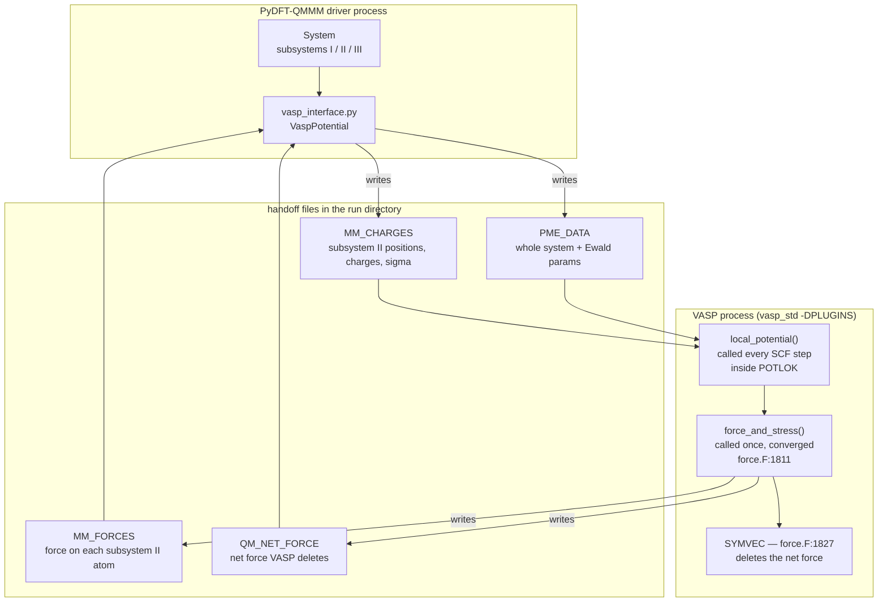

# VASP QM/MM interface — what this fork adds to PyDFT-QMMM

Upstream PyDFT-QMMM supports Psi4 (QM) and OpenMM (MM). This fork adds **VASP**
as a QM engine with **electrostatic embedding**, so a periodic plane-wave DFT
region can be coupled to an MM environment.

The method follows Todorova *et al.* (arXiv:2510.23328) §3.4 for the QM side and
Pederson & McDaniel (*J. Chem. Phys.* **156**, 174105) / John *et al.*
(*J. Chem. Phys.* **161**, 034103) for the QM/MM partitioning.

---

## 1. Why VASP needs different plumbing from Psi4

| | Psi4 | VASP |
|---|---|---|
| basis | atom-centred, non-periodic | plane-wave, **always periodic** |
| MM charges enter as | point charges in the integrals | a **potential on the FFT grid** |
| coupling mechanism | library call | **Python plugin** inside VASP's process |
| cell size | irrelevant | must match the MM box → dominates cost |

VASP cannot be handed point charges. The MM charges must be smeared into
Gaussians, solved on VASP's grid, and added to the local potential from *inside*
VASP — which is what the plugin does.

---

## 2. Architecture



**Data flow per energy/force evaluation**

1. Driver writes `MM_CHARGES` (subsystem II) and, under PME, `PME_DATA`.
2. VASP launches. `local_potential` builds `V_ext` on the fine FFT grid and adds
   it to the local potential, so the **electrons** feel the MM charges. VASP then
   handles `∫ρ·V_ext` and the electronic force response automatically.
3. `force_and_stress` adds the **nuclear** terms VASP omits (Todorova Eqs. 3–4),
   computes the **back-reaction** on the MM charges, and records the **net force**
   before VASP destroys it.
4. Driver reads `MM_FORCES` into subsystem II rows and restores the net force on
   the QM rows.

---

## 3. Files added

### Core (`pydft_qmmm/interfaces/vasp/`)

| file | lines | responsibility |
|---|---|---|
| `grid_potential.py` | 553 | **All the physics, numpy-only.** Gaussian spreading, FFT Poisson solve, spectral interpolation, the force-contraction kernel. No VASP or `pydft_qmmm` imports, so it is testable in milliseconds instead of 20-minute GPU jobs. |
| `vasp_plugin.py` | 321 | The two VASP callbacks. Runs **inside VASP's interpreter**, copied standalone into each run directory. |
| `vasp_interface.py` | 471 | `VaspInterface`/`VaspPotential` — writes inputs, launches VASP, parses results, restores the net force. |
| `vasp_utils.py` | 429 | POSCAR/POTCAR/KPOINTS/INCAR writers, `vasprun.xml` parsing, handoff-file readers. |
| `pme_external.py` | 143 | helPME evaluation of the long-range MM potential on VASP's grid. |
| `vasp_factory.py` | 137 | `vasp_interface_factory(...)` — the user-facing constructor. |

### Modified upstream files

| file | change | why |
|---|---|---|
| `hamiltonians/qmmm_hamiltonian.py` | `configure_electrostatic_embedding` hook; per-instance force matrix and partition | Lets the coupling Hamiltonian switch VASP embedding on. Also fixes a real upstream bug: the force matrix was shallow-copied, so configuring one Hamiltonian mutated every other one, and the default `CentroidPartition` was a shared mutable function default. |
| `interfaces/interface.py` | `QMInterface.configure_electrostatic_embedding()` | Base-class hook, no-op for engines that don't need it. |
| `interfaces/interface_manager.py` | register `vasp` | Makes the interface discoverable. |
| `utils/constants.py` | `KJMOL_PER_EV` | VASP works in eV; the rest of the package in kJ/mol. |
| `system/selection_utils.py` | `[:, *var[1]]` → `[(slice(None), *var[1])]` | **Upstream bug.** Starred unpacking in a subscript is PEP 646, a `SyntaxError` before Python 3.11 — but `pyproject.toml` declares `requires-python = ">=3.10"`. The package did not import on the Python it advertises. |

---

## 4. The physics implemented

### QM side — Todorova Eqs. 3–4

Adding `V_ext` to the local potential makes the **electrons** feel the MM
charges, and VASP handles that completely. But VASP's **ion cores never see
`V_ext`**, so two nuclear terms must be supplied by hand:

```
ΔE_I = −Z_I · V_ext(R_I)          energy   (Eq. 3)
ΔF_I = +Z_I · ∇V_ext(R_I)         force    (Eq. 4)
```

`Z_I` is **ZVAL**, the pseudopotential valence charge — not the atomic number.

> **Do not also add `∫ρ·V_ext`.** VASP's `TOTEN` already contains it. Measured
> (jobs 11566990, 11567275): adding it shifted the gradient from (14, 14, 5) to
> (−266, −985, 217), essentially the whole electronic response.

### MM side — the back-reaction

Evaluating the QM field at every MM position is O(N·N_grid) — hours per step.
Instead differentiate the symmetric form, which puts the derivative on the MM
charge's own Gaussian and makes it local:

```
F_j = −q_j ∫ φ_QM(r) ∇_{r_j} g_σ(r − r_j) dr        ~21³ points per atom
```

This is the exact transpose of the charge spreading — same kernel, same σ, same
6σ box — so Newton's third law holds term-by-term rather than approximately.

### The VASP net-force repair

`force.F:1827` calls `SYMVEC`, which subtracts the mean force from every ion.
That is correct for an isolated periodic cell and **wrong under embedding**,
where `V_ext` breaks translational invariance and the net force *is* the momentum
transferred to the MM subsystem.

`LREMOVE_DRIFT` is a hardcoded call-site argument, not an INCAR tag, so it cannot
be disabled from input. Since the plugin runs at `:1811`, **before** the removal,
it is the only place the true net can be recovered.

> `SYMVEC` exempts `NIONS==1`. That is why a single-atom validation looks clean
> while every multi-atom case is broken — and it explains a ~16 kJ/mol/Å residual
> that went unexplained through the previous milestone.

---

## 5. Subsystem partitioning

Follows John *et al.* Table I, **direct QM/MM/PME** (`X = QM`, `Y = MM`):

| subsystem | feels QM via | acts on QM via |
|---|---|---|
| **I** (QM) | — | — |
| **II** (near field) | grid contraction → `MM_FORCES` | analytic `V_ext` |
| **III** (long range) | **OpenMM**, static charges | helPME reciprocal sum |

Subsystem III's force from the QM region is deliberately **left to OpenMM**.
Computing it from VASP's density would be QM/MM/SC-PME — a different method —
and doing both would double-count.

**Consequence:** the I–III force pair is asymmetric by construction, so momentum
is conserved over I+II but **not** over I+II+III. John *et al.* state plainly that
these force expressions do not rigorously conserve energy; expect drift in long
NVE runs with a populated subsystem III.

---

## 6. How to use it

### Requirements

- `vasp_std` built with `-DPLUGINS` (this project uses VASP 6.6.1 / nvhpc 24.1)
- Python **3.10.x**, matching the `libpython3.10` the VASP binary links
- `helpme_py` (only for the PME path)
- `VASP_PP_PATH` pointing at a POTCAR library

The driver and the plugin must share **one** interpreter, so `PYTHONHOME` can be
exported globally.

### Minimal script

```python
from pydft_qmmm import System, QMMMHamiltonian
from pydft_qmmm.interfaces.vasp.vasp_factory import vasp_interface_factory

system = System.load("water.pdb")

qm = vasp_interface_factory(
    system,
    directory="vasp_workdir",
    pp_path="/path/to/potpaw_PBE.64",
    embedding=True,             # switch on the plugin
    embedding_sigma=0.3,        # Gaussian width, Angstrom
    incar={"ENCUT": 400, "EDIFF": 1e-6},
)
forces = qm.compute_forces()    # QM rows + subsystem II rows filled
```

Under a coupling Hamiltonian, `embedding` is set automatically:

```python
coupling = QMMMHamiltonian("electrostatic", "electrostatic")   # PME
coupling = QMMMHamiltonian("electrostatic", "cutoff")          # near-field only
```

### Settings that matter

| tag | value | why |
|---|---|---|
| `ISYM` | **must be 0** | Rejected otherwise. MM charges break the symmetry VASP infers from the QM atoms, and `FORSYM` would invalidate the net-force restoration. |
| `PLUGINS/MODE` | **leave unset** | Defaults to `serial`: only rank 1 calls the plugin and receives the *full* gathered grid. `parallel` would hand each rank a slab and a full-grid `V_ext` would be silently wrong. |
| `ISTART` | `0` for finite differences | Restart reuse poisons numerical gradients — only the x pair gets mismatched restart histories. Keep restart **on** for MD. |
| `EDIFF` | `1e-6` production, `1e-7` for gradient tests | |

### Running the tests

```bash
# no VASP needed — pure numpy physics, milliseconds
~/.conda/envs/vasp_qmmm/bin/python -m pytest tests/ -q

# VASP-backed tests are skipped unless this is set
export PYDFT_QMMM_VASP_COMMAND="mpirun -np 1 /path/to/vasp_std"
sbatch tests/data/vasp_embedding/thirdlaw.slurm     # Newton's third law
sbatch tests/data/vasp_embedding/mmgradient.slurm   # MM finite difference
```

---

## 7. Validation

| test | result | criterion |
|---|---|---|
| Newton's third law, I+II, real VASP | **0.28 %** | < 1 % |
| MM-atom finite difference | **0.013 kJ/mol/Å** | abs = 1.0 |
| QM-atom gradient (with net force restored) | **passed** | abs = 1.0 (was ~16) |
| Constant-field H atom (Todorova Fig. 2b) | 0.012 vs 5.820 uncorrected | ~0 |
| Unit suite | 98 passed, 8 skipped | |

---

## 8. Performance — read this before scaling up

The QM/MM overhead is **not** the MM work. `V_ext` costs ~6.7 s once per launch,
then 0.03 s per SCF step. Almost all the cost is that embedding forces a 3-atom
QM calculation into a 29.9 Å cell:

| per SCF step | time | scales with |
|---|---|---|
| `RMM-DIIS` (wavefunctions) | **0.03 s** | electron count |
| `POTLOK` (potential on the grid) | **4.09 s** | **cell volume** |

At 320³ = 32.8 M grid points, `POTLOK` is ~83 % of runtime. Levers, in order:

1. **`WAVECAR` restart + `EDIFF=1e-6`** in production — the test suite's
   `ISTART=0` forces a full 30-step SCF every launch. Free, ~3–6×.
2. **Smaller QM cell.** Bounded by subsystem II's extent, so it means shrinking
   the embedding cutoff and letting PME carry more. A 15 Å cell would be ~8×.
3. **MPI ranks** — uncertain, because `PLUGINS/MODE = serial` gathers the full
   grid to rank 1 every step.

---

## 9. Known limitations

- Momentum is conserved over **I+II only** (§5).
- `charge=0` only; a charged QM region needs `NELECT` plus a compensating background.
- The net-force restoration is a **workaround**, not a fix — VASP still computes
  the wrong thing and the driver undoes it. A one-line VASP source change
  (`LREMOVE_DRIFT=.FALSE.` when the plugin is active) would be cleaner but must be
  re-applied on every rebuild.
- Subsystem II's Gaussian width σ and the grid spacing are coupled: at 320³ over
  29.9 Å, σ=0.3 gives 3.2 points per σ. Coarsening the grid without raising σ
  under-resolves the embedding potential.

---

## 10. Reference

- Todorova *et al.*, arXiv:2510.23328 §3.4 — Eqs. 3–4, VASP plugin embedding
- Pederson & McDaniel, *J. Chem. Phys.* **156**, 174105 (2022) — QM/MM/PME, Fig. 4
- John *et al.*, *J. Chem. Phys.* **161**, 034103 (2024) — Table I force matrix
- `docs/superpowers/specs/2026-07-30-vasp-electrostatic-embedding-design.md`
- `docs/superpowers/specs/2026-07-30-vasp-mm-forces-design.md`
